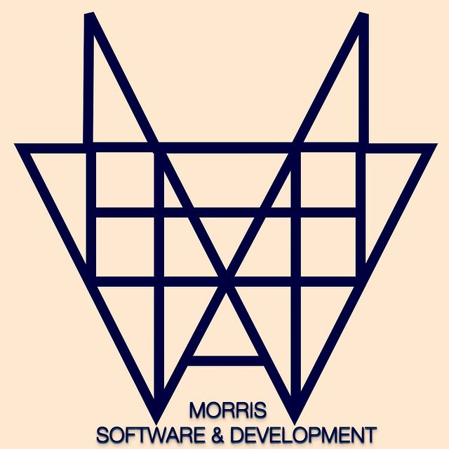

<header>
  



# Hi there Everyone Welcome 👋


## 🙋‍♂️ I'm a Full-Stack Software Developer who is open to building multiple applications

## 🌈 Contribution guidelines - Message me at matthewmorris@mattmorrisdev.com 

## 👩‍💻 Find my work here [My Github](https://github.com/mattymomo1993)

## 🍿 Fun facts - we eat bytes for breakfast 😋 


<picture>
  <source media="(prefers-color-scheme: dark)" srcset="https://user-images.githubusercontent.com/25423296/163456776-7f95b81a-f1ed-45f7-b7ab-8fa810d529fa.png">
  <source media="(prefers-color-scheme: light)" srcset="https://user-images.githubusercontent.com/25423296/163456779-a8556205-d0a5-45e2-ac17-42d089e3c3f8.png">
  
</picture>
</header>


<div>
  
## 🚀 Projects

### 🔍 NetWatch
> **Python · Flask · OSINT · Honeypots · Network Intelligence**
> 


[](https://pypi.org/project/netwatch-sec/)
[](https://github.com/Mattmorris-dev/netwatch-sec/blob/main/LICENSE)

All-in-one network security dashboard: 4 honeypots, live packet capture, OSINT, scanning, iptables defense, and LoRa mesh alerts. Single Python file, runs on a Pi.

```bash
pip install netwatch-sec
sudo netwatch
```

[](https://github.com/Mattmorris-dev/netwatch-sec)
[](https://pypi.org/project/netwatch-sec/)

---

### 🧠 Sentinel-SLM
> **C · Deep RNN · AI Security · Zero-Dependency**

A self-contained AI security agent in a single C file — a deep RNN that runs with no cloud, no API keys, no vendor, and no per-token bill.

[](https://github.com/Mattmorris-dev/Sentinel-SLM)
[](https://github.com/Mattmorris-dev/Sentinel-SLM/blob/main/LICENSE)

---

### 📡 Handshake Cracker
> **Python · Wireless Security · WPA/WPA2**

Wireless handshake capture and analysis tool. Built for authorized penetration testing and security research.

`[Private Repo]`

---

### 🛡️ Pi-hole Home Router
> **Raspberry Pi · Linux · Networking · DNS**

Converted a Raspberry Pi 3B+ into a full home router — Pi-hole, Unbound recursive DNS, iptables NAT, and 802.1Q VLAN trunking over a single ethernet port.

[](https://mattymomo1993.github.io/pihole-router-guide)
[](https://github.com/mattymomo1993/pihole-router-guide)
</div>
---
<div>
</picture>
</div>
